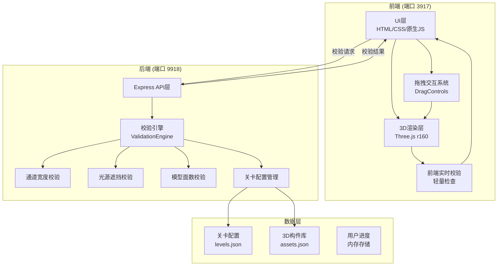
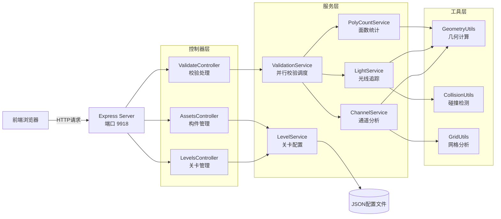
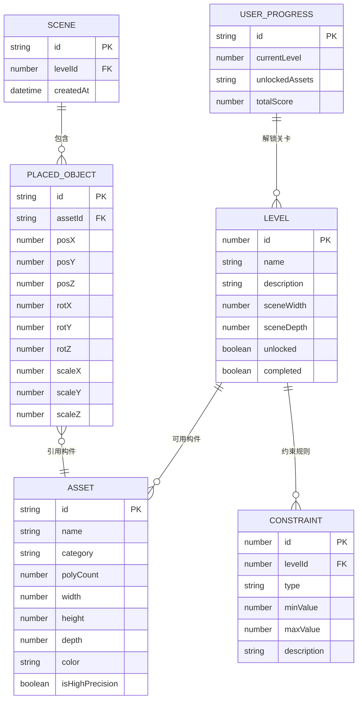

# 3D展厅搭建校验系统 - 技术架构文档

## 1. 架构设计



## 2. 技术描述

- **前端**：原生 HTML5 + CSS3 + JavaScript (ES6+)，Three.js r160 用于3D渲染，OrbitControls 用于视角控制，DragControls 用于3D拖拽
- **前端构建**：无需构建工具，直接通过 Express 静态文件服务访问
- **后端**：Node.js + Express@4.18.2，CORS 支持跨域请求
- **数据存储**：配置文件使用 JSON，用户进度使用内存 Map 存储（无需数据库）
- **3D资源**：使用 Three.js 内置几何体程序化生成3D模型，无需外部模型文件

## 3. 路由定义

| 路由 | 页面/用途 |
|-------|---------|
| / | 关卡选择页面 |
| /editor?level=1 | 3D搭建编辑器页面 |

## 4. API 定义

### 4.1 获取关卡配置

**GET /api/levels**

响应：
```typescript
interface Level {
  id: number;
  name: string;
  description: string;
  sceneSize: { width: number; depth: number };
  constraints: {
    minChannelWidth: number;
    maxPolyCount: number;
    minLightCount: number;
    minLightDistance?: number;
  };
  availableAssets: string[];
  unlocked: boolean;
  completed: boolean;
  reward: string[];
}

interface GetLevelsResponse {
  success: boolean;
  data: Level[];
}
```

### 4.2 获取构件库

**GET /api/assets**

响应：
```typescript
interface Asset3D {
  id: string;
  name: string;
  category: 'wall' | 'booth' | 'light' | 'decoration';
  polyCount: number;
  size: { width: number; height: number; depth: number };
  color: string;
  isHighPrecision: boolean;
}

interface GetAssetsResponse {
  success: boolean;
  data: Asset3D[];
}
```

### 4.3 提交场景校验

**POST /api/validate**

请求：
```typescript
interface PlacedObject {
  id: string;
  assetId: string;
  position: { x: number; y: number; z: number };
  rotation: { x: number; y: number; z: number };
  scale: { x: number; y: number; z: number };
  polyCount: number;
}

interface ValidateRequest {
  levelId: number;
  objects: PlacedObject[];
}
```

响应：
```typescript
interface ValidationError {
  type: 'channel' | 'light' | 'polycount';
  severity: 'error' | 'warning';
  message: string;
  objectIds?: string[];
  position?: { x: number; z: number };
  suggestion: string;
}

interface ValidateResponse {
  success: boolean;
  data: {
    passed: boolean;
    score: number;
    totalPolyCount: number;
    errors: ValidationError[];
    channelWidth: {
      minWidth: number;
      requiredWidth: number;
      passed: boolean;
    };
    lightOcclusion: {
      totalLights: number;
      occludedLights: number;
      passed: boolean;
      details: Array<{
        lightId: string;
        occludedBy: string[];
        occlusionRate: number;
      }>;
    };
    polyCount: {
      current: number;
      limit: number;
      passed: boolean;
    };
    unlockedRewards?: string[];
  };
}
```

### 4.4 生成快速验证场景

**POST /api/generate-test-scene**

请求：
```typescript
interface GenerateTestRequest {
  levelId: number;
  testType: 'narrow_channel' | 'high_polycount' | 'light_occlusion' | 'all';
}
```

响应：
```typescript
interface GenerateTestResponse {
  success: boolean;
  data: {
    objects: PlacedObject[];
    expectedErrors: string[];
    description: string;
  };
}
```

## 5. 服务器架构图



## 6. 数据模型

### 6.1 数据模型定义



### 6.2 校验引擎核心算法

#### 通道宽度校验算法
1. 将展厅地面划分为 0.1m × 0.1m 的网格单元
2. 标记所有被墙体、展台占据的网格为障碍物
3. 使用洪水填充算法(Flood Fill)从入口位置开始标记所有可达区域
4. 对可达区域进行距离变换(Distance Transform)，计算每个网格到最近障碍物的距离
5. 最小通道宽度 = 2 × 最小距离值（考虑双向通行）
6. 与关卡要求的 minChannelWidth 比较，判定是否通过

#### 光源遮挡校验算法
1. 对每盏光源，计算其光锥范围内的所有展台对象
2. 使用光线步进(Ray Marching)从光源向展台表面采样100条光线
3. 每条光线检测与其他展台对象的相交情况
4. 遮挡率 = 被遮挡光线数 / 总光线数
5. 遮挡率 > 30% 判定为光源被遮挡
6. 统计被遮挡光源数量，与关卡要求比较

#### 模型面数校验算法
1. 遍历场景中所有放置的对象
2. 每个对象的实际面数 = 构件基础面数 × (scaleX × scaleY × scaleZ)^0.5
3. 累加所有对象的面数得到场景总面数
4. 与关卡 maxPolyCount 比较，判定是否通过
