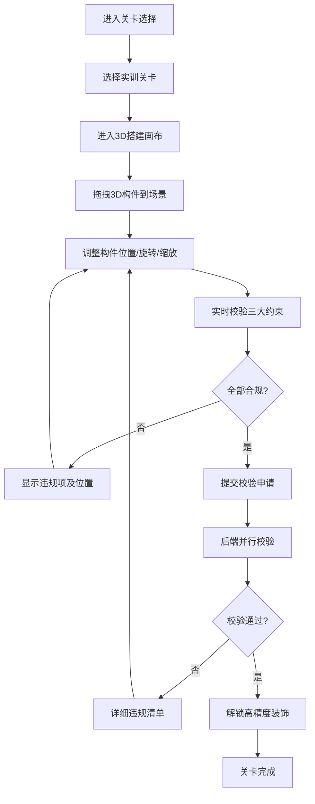

# 3D展厅搭建校验系统 - 产品需求文档

## 1. 产品概述

面向3D设计师岗前实训的纯3D展厅搭建校验游戏，通过多层空间约束并行校验机制，训练设计师对空间布局、性能优化、光源设计的综合把控能力。玩家拖拽3D构件搭建展厅，系统实时校验通道宽度、光源遮挡、模型面数等约束，全部合规即可解锁高精度装饰模型。

## 2. 核心功能

### 2.1 用户角色

| 角色 | 注册方式 | 核心权限 |
|------|----------|----------|
| 实训设计师 | 匿名进入 | 体验全部关卡、拖拽搭建、查看校验结果 |

### 2.2 功能模块

1. **关卡选择页**：关卡列表、难度标识、解锁状态、当前成绩
2. **3D搭建画布**：三维场景渲染、素材拖拽、视角控制、实时预览
3. **素材库面板**：墙体、展台、灯光、装饰四大类3D构件
4. **约束校验面板**：通道宽度、光源遮挡、模型面数三大维度实时校验
5. **校验结果弹窗**：违规项列表、整改建议、通关奖励展示

### 2.3 页面详情

| 页面名称 | 模块名称 | 功能描述 |
|---------|----------|---------|
| 关卡选择页 | 关卡网格 | 展示3个难度递进的实训关卡，显示通关状态和最高分 |
| 关卡选择页 | 关卡信息卡 | 展示关卡名称、约束参数、解锁条件、实训目标 |
| 3D搭建画布 | 三维视口 | 基于Three.js的12m×8m展厅空间，支持轨道视角控制 |
| 3D搭建画布 | 拖拽系统 | 从素材库拖拽3D模型到场景，支持平移、旋转、缩放操作 |
| 3D搭建画布 | 辅助网格 | 显示1m间隔的地面网格和对齐吸附线 |
| 素材库面板 | 分类切换 | 墙体、展台、灯光、装饰四大类构件切换 |
| 素材库面板 | 构件预览 | 缩略图展示构件名称、面数、尺寸信息 |
| 约束校验面板 | 通道宽度 | 检测通行区域最小宽度，低于下限标记违规 |
| 约束校验面板 | 光源遮挡 | 检测展台与光源的空间关系，遮挡光线标记违规 |
| 约束校验面板 | 模型面数 | 统计场景总面数，超出上限标记违规 |
| 校验结果弹窗 | 违规清单 | 分维度列出所有违规项及具体位置 |
| 校验结果弹窗 | 通关奖励 | 全部合规后解锁高精度装饰模型 |
| 校验结果弹窗 | 快速验证 | 提供"刻意违规"测试按钮，快速验证校验逻辑 |

## 3. 核心流程

玩家进入关卡选择页面，选择已解锁的实训关卡进入3D搭建画布。从素材库拖拽墙体、展台、灯光等3D构件到展厅场景中，通过平移、旋转、缩放调整布局。系统实时并行校验三大约束，面板同步显示每项约束的达标状态。点击提交校验按钮，后端执行完整校验逻辑，返回详细的违规清单或通关奖励。玩家可根据违规提示调整布局，直至全部约束合规，解锁高精度装饰模型。

## 4. 用户界面设计

### 4.1 设计风格

- **主色调**：深空蓝 `#0a1628` 为背景，科技青 `#00d4ff` 为强调色，警示红 `#ff4757` 标记违规，成功绿 `#2ed573` 标记合规
- **按钮风格**：圆角8px，微立体边框，hover时发光效果，禁用状态半透明
- **字体**：主标题使用 `Orbitron` 科技字体，正文使用 `Inter`，数字使用 `JetBrains Mono` 等宽字体
- **布局风格**：左侧素材库 + 中央3D画布 + 右侧校验面板的三栏式布局，顶部为关卡信息栏
- **图标风格**：线性图标搭配彩色背景块，3D构件使用真实渲染缩略图

### 4.2 页面设计概览

| 页面名称 | 模块名称 | UI元素 |
|---------|----------|--------|
| 关卡选择页 | 关卡网格 | 卡片式布局，通关关卡显示金色边框，当前关卡显示脉冲动画 |
| 3D搭建画布 | 三维视口 | 暗灰色地面网格，蓝色辅助线，选中物体显示橙色包围盒 |
| 素材库面板 | 构件列表 | 悬停放大效果，拖拽时半透明跟随预览 |
| 约束校验面板 | 状态指示器 | 每项约束显示进度条和状态图标，违规项抖动动画 |
| 校验结果弹窗 | 违规清单 | 红色警告图标，点击违规项自动定位到场景对应位置 |

### 4.3 响应式

- 桌面端优先设计，最小支持1280px宽度
- 三栏布局在小屏幕自动折叠为可展开的侧边栏
- 3D画布自适应容器尺寸，保持16:9比例
- 触屏设备支持双指缩放和单指拖拽

### 4.4 3D场景指引

- **环境/HDRI**：使用工业风格HDR环境贴图，柔和的展厅照明，避免过度反光
- **光照设置**：默认环境光+方向光基础照明，玩家放置的灯光使用聚光灯/点光源，支持阴影投射
- **相机设置**：轨道控制器，默认45°俯视角，限制最低视角防止穿模，支持缩放和平移
- **构图与焦点**：展厅居中布局，入口在前方，通行通道用半透明蓝色体积光标记
- **交互与动画**：构件拖拽时的半透明预览，放置时的弹性动画，选中时的边框发光
- **后处理效果**：轻微的屏幕空间环境光遮蔽(SSAO)，色彩分级，违规物体的红色描边
- **资源与性能**：基础构件面数控制在500-2000三角面，高精度装饰模型5000-10000面，场景总面数上限根据关卡设定

## 5. 关卡设计

### 关卡1：入门展厅
- **场景尺寸**：8m × 6m
- **通道宽度下限**：1.5m
- **光源要求**：2盏聚光灯，无遮挡
- **总面数上限**：50000三角面
- **可用构件**：基础墙体、3款展台、2款灯光
- **解锁奖励**：玻璃展柜

### 关卡2：标准展厅
- **场景尺寸**：10m × 8m
- **通道宽度下限**：1.8m
- **光源要求**：3盏灯，展台与光源距离≥1m
- **总面数上限**：80000三角面
- **可用构件**：全部基础构件 + 弧形墙体
- **解锁奖励**：金属展台 + 轨道灯

### 关卡3：精品展厅
- **场景尺寸**：12m × 10m
- **通道宽度下限**：2.0m
- **光源要求**：4盏灯，光线照射角度限制
- **总面数上限**：120000三角面
- **可用构件**：全部构件
- **解锁奖励**：高精度雕塑 + 装饰绿植
